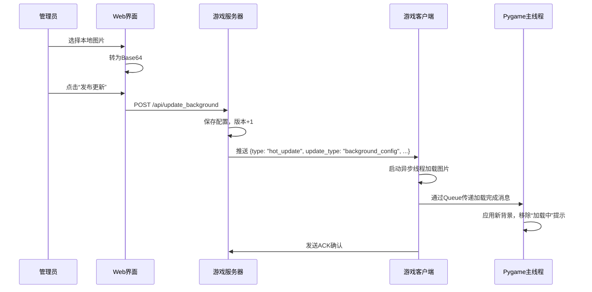

### 导入

之前发布了两篇讲联机游戏原理的博客，然后最近在邮箱收到一个读者的邮件，向我请教联机游戏中更新的问题，因此我就写了一个例子，通过这篇博客简单进行说明。

联机游戏更新作者觉得主要有两类：

- 热补丁更新：无需重新下载和退出客户端，实时就生效的补丁更新，一般包括UI界面资源（比如音效、图片等资源文件），脚本逻辑，游戏配置数据，非核心的游戏逻辑等

- 版本更新和冷补丁：安全性修复，核心游戏内容更新，关键数据结构重构，改变了二进制文件，需要退出游戏，重新下载，当然一般是增量下载，才能完成更新，再次进入游戏

这篇博客主要讲解热补丁更新的方式，然后稍微简单说明第二种更新方式。所谓热补丁就是不影响玩家游玩的情况下可以对客户端进行的修改，实时生效，非常灵活。比如UI图片资源，举个例子，到时间点就修改游戏主页展示的图片；还有比如游戏逻辑的修改。没错，现代游戏编写一般是脚本语言编写核心游戏逻辑，然后客户端动态加载脚本语言，因此可以实现热补丁直接更新。比如unity用C#编写游戏，然后可以用lua脚本语言编写内部游戏运行逻辑，然后lua脚本可以动态下载替换和修改，当然unity还有`AssetBundle`的热更新方式，可以用`AssetBundle.LoadAsset()` 动态加载打包好的`.assetbundle`文件。

实现的程序通过服务器端开启一个`Flask`浏览器页面，从这个后台web页面中发布热更新。

### 核心原理

#### TCP 消息协议（带长度前缀）

可以避免避免粘包/半包问题，采用`[4字节长度头][JSON消息体]`的数据包格式。

```python
# 发送
json_data = json.dumps(msg).encode('utf-8')
length_prefix = len(json_data).to_bytes(4, 'big')
socket.sendall(length_prefix + json_data)

# 接收
length_data = recv_all(4)
msg_length = int.from_bytes(length_data, 'big')
msg_data = recv_all(msg_length)
```

#### 热更新脚本执行机制

使用 Python 内置 `exec()` 实现动态脚本加载：

```python
local_scope = {}
exec(script_content, {}, local_scope)
if 'update_ball_position' in local_scope:
    self.script_logic = local_scope['update_ball_position']
```

- ✅ 优点：灵活，可修改任意逻辑
- ⚠️ 风险：需做沙箱隔离（本项目简化处理）

#### 背景资源热更新原理

```python
# Base64解码并加载图片
image_data = base64.b64decode(bg_config["background_image"])
image_file = io.BytesIO(image_data)
background_surface = pygame.image.load(image_file)
```

#### 资源异步加载机制

使用 `queue.Queue` + 子线程实现线程安全通信：

```python
# 子线程加载完成后
self.background_load_queue.put({
    "type": "background_loaded",
    "surface": pygame_surface,
    "version": version
})

# 主线程每帧轮询
while not self.background_load_queue.empty():
    msg = self.background_load_queue.get_nowait()
    if msg["type"] == "background_loaded":
        self.background_config["background_surface"] = msg["surface"]
```

#### Web 图片上传 Base64 转换

前端 JavaScript 实现：

```js
const reader = new FileReader();
reader.onload = function(e) {
    const base64String = e.target.result.split(',')[1].replace(/\s/g, '');
    document.getElementById('bgImage').value = base64String;
};
reader.readAsDataURL(file);
```

#### 心跳与连接保活机制

- 客户端每 10 秒发送心跳包
- 服务器记录最后活跃时间
- 连接异常时自动重连
- 服务器不因单次错误断开客户端

```python
def send_heartbeat(self):
    while self.running:
        try:
            # 发送心跳
            self.socket.sendall(...)
        except:
            # 重连
            self.socket = None
            self.connect_to_server()
        time.sleep(10)
```

### 架构解析

**服务器**：

- **游戏服务器**：处理客户端连接，推送热更新
- **Web配置界面**：基于Flask的管理后台，实时发布热补丁
- **热更新配置管理**：存储脚本逻辑和背景配置

**客户端**：

- **Pygame UI界面**：显示移动的小球和背景
- **热更新接收器**：监听服务器推送的更新
- **动态脚本执行器**：使用`exec()`动态加载新逻辑
- **资源管理器**：处理背景图片的动态加载

**架构图**：

```
+---------------------+     TCP Socket     +---------------------+
|   Pygame Client     | <----------------> |   Game Server       |
|  - 游戏主循环       |   (带长度前缀)     |  - 客户端连接管理    |
|  - 热更新接收器     |                   |  - 心跳维护          |
|  - 异步资源加载     |                   +----------+----------+
+----------+----------+                              |
           |                                         |
           | HTTP API                                |  TCP Push
           v                                         v
+---------------------+                   +---------------------+
|   Web Admin Panel   |                   |   Hot Update Config |
|  - 脚本编辑器       | <--------------- |  - script_logic     |
|  - 图片上传转Base64 |    RESTful API   |  - background_config|
+---------------------+                   +---------------------+
```


**热更新流程图（以图片热补丁为例）**：



### 完整代码：

为了方便，直接集成客户端和服务器端在一起：

```python
import os
import sys
import json
import time
import threading
import socket
import hashlib
from datetime import datetime
import importlib.util
import queue
import select

# ============ 服务器端（带Web配置界面） ============
from flask import Flask, render_template_string, request, jsonify, send_file
import base64

class HotUpdateServer:
    def __init__(self, game_server_port=8888, web_port=5000):
        self.game_server_port = game_server_port
        self.web_port = web_port
        self.clients = {}
        self.running = True

        # 热更新配置 - 存储在内存中，实际项目应持久化
        self.hot_update_config = {
            "script_logic": {
                "version": "1.0.0",
                "last_update": datetime.now().strftime("%Y-%m-%d %H:%M:%S"),
                "content": """# 默认移动逻辑
def update_ball_position(ball_x, ball_y, ball_speed_x, ball_speed_y, screen_width, screen_height):
    # 基础移动逻辑
    ball_x += ball_speed_x
    ball_y += ball_speed_y

    # 边界检测
    if ball_x <= 0 or ball_x >= screen_width - 30:
        ball_speed_x = -ball_speed_x
    if ball_y <= 0 or ball_y >= screen_height - 30:
        ball_speed_y = -ball_speed_y

    return ball_x, ball_y, ball_speed_x, ball_speed_y
""",
                "enabled": True
            },
            "background_config": {
                "version": "1.0.0",
                "last_update": datetime.now().strftime("%Y-%m-%d %H:%M:%S"),
                "background_color": [30, 40, 50],
                "background_image": None,  # Base64编码的图片数据
                "enabled": True
            }
        }

        # 创建Flask应用
        self.app = Flask(__name__)
        self.setup_routes()

        # 创建示例背景图片（如果不存在）
        self.create_sample_background()

    def create_sample_background(self):
        """创建示例背景图片"""
        try:
            from PIL import Image, ImageDraw
            import io

            # 创建一个简单的渐变背景
            width, height = 800, 600
            image = Image.new('RGB', (width, height), (30, 40, 50))
            draw = ImageDraw.Draw(image)

            # 添加一些装饰性线条
            for i in range(0, width, 50):
                alpha = int(255 * (i / width))
                draw.line([(i, 0), (i, height)], fill=(100, 150, 200, alpha), width=1)

            for i in range(0, height, 50):
                alpha = int(255 * (i / height))
                draw.line([(0, i), (width, i)], fill=(100, 150, 200, alpha), width=1)

            # 保存为base64
            buffered = io.BytesIO()
            image.save(buffered, format="PNG")
            img_str = base64.b64encode(buffered.getvalue()).decode('utf-8')

            self.hot_update_config["background_config"]["background_image"] = img_str

        except ImportError:
            print("PIL未安装，使用纯色背景")
            pass

    def setup_routes(self):
        """设置Web路由"""

        @self.app.route('/')
        def index():
            return render_template_string(self.get_html_template())

        @self.app.route('/api/config')
        def get_config():
            return jsonify(self.hot_update_config)

        @self.app.route('/api/update_script', methods=['POST'])
        def update_script():
            data = request.json
            new_script = data.get('script', '')
            new_version = data.get('version', '1.0.0')

            if new_script:
                self.hot_update_config["script_logic"]["content"] = new_script
                self.hot_update_config["script_logic"]["version"] = new_version
                self.hot_update_config["script_logic"]["last_update"] = datetime.now().strftime("%Y-%m-%d %H:%M:%S")

                # 通知所有客户端更新
                self.notify_clients_update("script_logic")

                return jsonify({"success": True, "message": "脚本更新成功"})
            else:
                return jsonify({"success": False, "message": "脚本内容不能为空"})

        @self.app.route('/api/update_background', methods=['POST'])
        def update_background():
            data = request.json
            bg_color = data.get('background_color', [30, 40, 50])
            bg_image = data.get('background_image', None)
            new_version = data.get('version', '1.0.0')

            # 确保 Base64 字符串是普通字符串（避免二进制干扰）
            if bg_image is not None:
                if isinstance(bg_image, str):
                    # 清理可能的换行或空格
                    bg_image = bg_image.strip().replace('\n', '').replace('\r', '')
                else:
                    bg_image = None  # 非字符串一律设为 None

            self.hot_update_config["background_config"]["background_color"] = bg_color
            self.hot_update_config["background_config"]["background_image"] = bg_image
            self.hot_update_config["background_config"]["version"] = new_version
            self.hot_update_config["background_config"]["last_update"] = datetime.now().strftime("%Y-%m-%d %H:%M:%S")

            self.notify_clients_update("background_config")

            return jsonify({"success": True, "message": "背景配置更新成功"})

        @self.app.route('/api/clients')
        def get_clients():
            client_list = []
            for client_id, info in self.clients.items():
                client_list.append({
                    "id": client_id,
                    "address": info["address"],
                    "version": info["version"],
                    "last_active": info["last_active"]
                })
            return jsonify(client_list)

    def notify_clients_update(self, update_type):
        """通知所有客户端有更新（修复大消息发送）"""
        update_message = {
            "type": "hot_update",
            "update_type": update_type,
            "config": self.hot_update_config[update_type],
            "timestamp": time.time()
        }

        json_data = json.dumps(update_message, ensure_ascii=False).encode('utf-8')
        length_prefix = len(json_data).to_bytes(4, byteorder='big')  # 4字节长度头

        clients_to_remove = []
        for client_id, client_info in self.clients.items():
            try:
                # 先发送长度，再发送数据
                client_info["socket"].sendall(length_prefix + json_data)
            except Exception as e:
                print(f"通知客户端 {client_id} 失败: {e}")
                clients_to_remove.append(client_id)

        for client_id in clients_to_remove:
            if client_id in self.clients:
                del self.clients[client_id]

    def start_game_server(self):
        """启动游戏服务器"""
        server_socket = socket.socket(socket.AF_INET, socket.SOCK_STREAM)
        server_socket.setsockopt(socket.SOL_SOCKET, socket.SO_REUSEADDR, 1)
        server_socket.bind(('localhost', self.game_server_port))
        server_socket.listen(5)
        print(f"游戏服务器启动于 localhost:{self.game_server_port}")

        while self.running:
            try:
                client_socket, address = server_socket.accept()
                client_thread = threading.Thread(
                    target=self.handle_client,
                    args=(client_socket, address)
                )
                client_thread.daemon = True
                client_thread.start()
            except Exception as e:
                if self.running:
                    print(f"游戏服务器错误: {e}")
                break

        server_socket.close()

    def handle_client(self, client_socket, address):
        client_id = f"{address[0]}:{address[1]}"
        print(f"新客户端连接: {client_id}")

        try:
            # 接收客户端信息
            data = client_socket.recv(1024).decode('utf-8')
            client_info = json.loads(data)

            # 保存客户端信息
            self.clients[client_id] = {
                "socket": client_socket,
                "address": address,
                "version": client_info.get("version", "unknown"),
                "last_active": datetime.now().strftime("%Y-%m-%d %H:%M:%S"),
                "alive": True  # 标记客户端存活状态
            }

            # 发送当前热更新配置
            initial_config = {
                "type": "initial_config",
                "script_logic": self.hot_update_config["script_logic"],
                "background_config": self.hot_update_config["background_config"]
            }

            json_data = json.dumps(initial_config, ensure_ascii=False).encode('utf-8')
            length_prefix = len(json_data).to_bytes(4, byteorder='big')
            client_socket.sendall(length_prefix + json_data)

            print(f"已向客户端 {client_id} 发送初始配置")

            # 保持连接，不要因一次异常就断开
            while self.running and self.clients.get(client_id, {}).get("alive", False):
                try:
                    # 使用 select 避免长时间阻塞
                    ready, _, _ = select.select([client_socket], [], [], 1.0)
                    if not ready:
                        continue

                    data = client_socket.recv(4)
                    if not data or len(data) < 4:
                        break

                    message_length = int.from_bytes(data, byteorder='big')
                    if message_length <= 0 or message_length > 10*1024*1024:
                        continue

                    message_data = b''
                    while len(message_data) < message_length:
                        chunk = client_socket.recv(min(4096, message_length - len(message_data)))
                        if not chunk:
                            break
                        message_data += chunk

                    if len(message_data) != message_length:
                        continue

                    message = json.loads(message_data.decode('utf-8'))

                    if message.get("type") == "heartbeat":
                        self.clients[client_id]["last_active"] = datetime.now().strftime("%Y-%m-%d %H:%M:%S")
                    elif message.get("type") == "ack_update":
                        update_type = message.get("update_type")
                        print(f"客户端 {client_id} 确认接收 {update_type} 更新")

                except (ConnectionResetError, ConnectionAbortedError) as e:
                    print(f"客户端 {client_id} 连接异常: {e}")
                    break
                except Exception as e:
                    # 不要因为解析错误就断开连接！
                    print(f"处理客户端消息时发生非致命错误: {e}")
                    continue  # 继续循环，保持连接

        except Exception as e:
            print(f"处理客户端 {client_id} 时出错: {e}")
        finally:
            if client_id in self.clients:
                self.clients[client_id]["alive"] = False
                del self.clients[client_id]
            try:
                client_socket.close()
            except:
                pass
            print(f"客户端 {client_id} 断开连接")

    def get_html_template(self):
        """返回Web界面HTML模板"""
        return '''
<!DOCTYPE html>
<html>
<head>
    <title>游戏热更新管理后台</title>
    <meta charset="utf-8">
    <style>
        body { font-family: Arial, sans-serif; margin: 20px; background: #f5f5f5; }
        .container { max-width: 1200px; margin: 0 auto; }
        .card { background: white; padding: 20px; margin: 20px 0; border-radius: 8px; box-shadow: 0 2px 4px rgba(0,0,0,0.1); }
        h1 { color: #333; border-bottom: 2px solid #007bff; padding-bottom: 10px; }
        h2 { color: #555; margin-top: 30px; }
        textarea { width: 100%; height: 300px; margin: 10px 0; padding: 10px; font-family: monospace; }
        input, button { padding: 8px 16px; margin: 5px; }
        button { background: #007bff; color: white; border: none; border-radius: 4px; cursor: pointer; }
        button:hover { background: #0056b3; }
        .clients-list { margin-top: 20px; }
        .client-item { padding: 10px; border: 1px solid #ddd; margin: 5px 0; border-radius: 4px; }
        .status { color: #28a745; }
        .config-item { margin: 15px 0; padding: 15px; background: #f8f9fa; border-radius: 4px; }
        .version-info { color: #6c757d; font-size: 0.9em; }
        .update-log { background: #e9ecef; padding: 10px; border-radius: 4px; margin: 10px 0; }
    </style>
</head>
<body>
    <div class="container">
        <h1>游戏热更新管理后台</h1>

        <div class="card">
            <h2>当前连接的客户端</h2>
            <div id="clientsList" class="clients-list">
                <p>加载中...</p>
            </div>
        </div>

        <div class="card">
            <h2>脚本逻辑热更新</h2>
            <div class="config-item">
                <div class="version-info">
                    当前版本: <span id="scriptVersion">1.0.0</span><br>
                    最后更新: <span id="scriptLastUpdate">-</span>
                </div>
                <textarea id="scriptContent" placeholder="输入Python脚本逻辑..."></textarea>
                <div>
                    <input type="text" id="scriptNewVersion" placeholder="新版本号" value="1.1.0">
                    <button onclick="updateScriptLogic()">发布脚本更新</button>
                </div>
                <div class="update-log" id="scriptUpdateLog"></div>
            </div>
        </div>

        <div class="card">
            <h2>背景配置热更新</h2>
            <div class="config-item">
                <div class="version-info">
                    当前版本: <span id="bgVersion">1.0.0</span><br>
                    最后更新: <span id="bgLastUpdate">-</span>
                </div>
                <div>
                    <h3>背景颜色</h3>
                    <label>R: <input type="number" id="bgColorR" min="0" max="255" value="30"></label>
                    <label>G: <input type="number" id="bgColorG" min="0" max="255" value="40"></label>
                    <label>B: <input type="number" id="bgColorB" min="0" max="255" value="50"></label>
                </div>
                <div>
                    <h3>背景图片 (Base64)</h3>
                    <textarea id="bgImage" placeholder="粘贴Base64编码的图片数据..." rows="5"></textarea>
                    <div style="margin: 15px 0;">
                <input type="file" id="bgImageUpload" accept="image/*">
                <button onclick="loadImageAsBase64()">上传并转换</button>
                <span id="uploadStatus" style="color: #007bff; margin-left: 10px;"></span>
            </div>

            <script>
            function loadImageAsBase64() {
                const fileInput = document.getElementById('bgImageUpload');
                const file = fileInput.files[0];
                if (!file) {
                    alert('请选择一张图片');
                    return;
                }

                const reader = new FileReader();
                reader.onload = function(e) {
                    // 提取 Base64 部分并清理
                    let base64String = e.target.result.split(',')[1];
                    // 移除所有换行和空白（避免JSON解析问题）
                    base64String = base64String.replace(/\s/g, '');

                    document.getElementById('bgImage').value = base64String;
                    document.getElementById('uploadStatus').textContent = '✅ 图片已转换为 Base64';

                    // 预览
                    const preview = document.createElement('img');
                    preview.src = e.target.result;
                    preview.style.maxWidth = '200px';
                    preview.style.marginTop = '10px';
                    preview.style.border = '1px solid #ccc';

                    const existingPreview = document.getElementById('imagePreview');
                    if (existingPreview) existingPreview.remove();
                    preview.id = 'imagePreview';
                    document.querySelector('#bgImage').parentNode.appendChild(preview);
                };
                reader.onerror = function() {
                    document.getElementById('uploadStatus').textContent = '❌ 读取失败';
                };
                reader.readAsDataURL(file);
            }
            </script>
                    <p>提示: 可以留空使用纯色背景</p>
                </div>
                <div>
                    <input type="text" id="bgNewVersion" placeholder="新版本号" value="1.1.0">
                    <button onclick="updateBackgroundConfig()">发布背景更新</button>
                </div>
                <div class="update-log" id="bgUpdateLog"></div>
            </div>
        </div>
    </div>

    <script>
        // 加载初始配置
        async function loadConfig() {
            try {
                const response = await fetch('/api/config');
                const config = await response.json();

                // 更新脚本配置显示
                document.getElementById('scriptContent').value = config.script_logic.content;
                document.getElementById('scriptVersion').textContent = config.script_logic.version;
                document.getElementById('scriptLastUpdate').textContent = config.script_logic.last_update;

                // 更新背景配置显示
                const bgColor = config.background_config.background_color;
                document.getElementById('bgColorR').value = bgColor[0];
                document.getElementById('bgColorG').value = bgColor[1];
                document.getElementById('bgColorB').value = bgColor[2];
                document.getElementById('bgImage').value = config.background_config.background_image || '';
                document.getElementById('bgVersion').textContent = config.background_config.version;
                document.getElementById('bgLastUpdate').textContent = config.background_config.last_update;

                loadClients();
            } catch (error) {
                console.error('加载配置失败:', error);
            }
        }

        // 加载客户端列表
        async function loadClients() {
            try {
                const response = await fetch('/api/clients');
                const clients = await response.json();

                const clientsList = document.getElementById('clientsList');
                clientsList.innerHTML = '';

                if (clients.length === 0) {
                    clientsList.innerHTML = '<p>暂无客户端连接</p>';
                    return;
                }

                clients.forEach(client => {
                    const div = document.createElement('div');
                    div.className = 'client-item';
                    div.innerHTML = `
                        <strong>客户端ID:</strong> ${client.id}<br>
                        <strong>版本:</strong> ${client.version}<br>
                        <strong>最后活跃:</strong> ${client.last_active}<br>
                        <span class="status">在线</span>
                    `;
                    clientsList.appendChild(div);
                });
            } catch (error) {
                console.error('加载客户端列表失败:', error);
            }
        }

        // 更新脚本逻辑
        async function updateScriptLogic() {
            const scriptContent = document.getElementById('scriptContent').value;
            const newVersion = document.getElementById('scriptNewVersion').value;

            if (!scriptContent.trim()) {
                alert('脚本内容不能为空');
                return;
            }

            try {
                const response = await fetch('/api/update_script', {
                    method: 'POST',
                    headers: {
                        'Content-Type': 'application/json',
                    },
                    body: JSON.stringify({
                        script: scriptContent,
                        version: newVersion
                    })
                });

                const result = await response.json();

                const logDiv = document.getElementById('scriptUpdateLog');
                if (result.success) {
                    logDiv.innerHTML = `<p style="color: green;">✅ ${new Date().toLocaleString()}: ${result.message}</p>` + logDiv.innerHTML;
                    document.getElementById('scriptVersion').textContent = newVersion;
                    document.getElementById('scriptLastUpdate').textContent = new Date().toLocaleString();
                } else {
                    logDiv.innerHTML = `<p style="color: red;">❌ ${new Date().toLocaleString()}: ${result.message}</p>` + logDiv.innerHTML;
                }
            } catch (error) {
                console.error('更新脚本失败:', error);
                document.getElementById('scriptUpdateLog').innerHTML = 
                    `<p style="color: red;">❌ ${new Date().toLocaleString()}: 网络错误</p>` + 
                    document.getElementById('scriptUpdateLog').innerHTML;
            }
        }

        // 更新背景配置
        async function updateBackgroundConfig() {
            const bgColorR = parseInt(document.getElementById('bgColorR').value) || 0;
            const bgColorG = parseInt(document.getElementById('bgColorG').value) || 0;
            const bgColorB = parseInt(document.getElementById('bgColorB').value) || 0;
            const bgImage = document.getElementById('bgImage').value;
            const newVersion = document.getElementById('bgNewVersion').value;

            try {
                const response = await fetch('/api/update_background', {
                    method: 'POST',
                    headers: {
                        'Content-Type': 'application/json',
                    },
                    body: JSON.stringify({
                        background_color: [bgColorR, bgColorG, bgColorB],
                        background_image: bgImage || null,
                        version: newVersion
                    })
                });

                const result = await response.json();

                const logDiv = document.getElementById('bgUpdateLog');
                if (result.success) {
                    logDiv.innerHTML = `<p style="color: green;">✅ ${new Date().toLocaleString()}: ${result.message}</p>` + logDiv.innerHTML;
                    document.getElementById('bgVersion').textContent = newVersion;
                    document.getElementById('bgLastUpdate').textContent = new Date().toLocaleString();
                } else {
                    logDiv.innerHTML = `<p style="color: red;">❌ ${new Date().toLocaleString()}: ${result.message}</p>` + logDiv.innerHTML;
                }
            } catch (error) {
                console.error('更新背景配置失败:', error);
                document.getElementById('bgUpdateLog').innerHTML = 
                    `<p style="color: red;">❌ ${new Date().toLocaleString()}: 网络错误</p>` + 
                    document.getElementById('bgUpdateLog').innerHTML;
            }
        }

        // 定时刷新
        setInterval(loadClients, 5000);

        // 页面加载完成后初始化
        window.onload = function() {
            loadConfig();
        };
    </script>
</body>
</html>
        '''

    def start(self):
        """启动服务器"""
        # 启动游戏服务器线程
        game_server_thread = threading.Thread(target=self.start_game_server)
        game_server_thread.daemon = True
        game_server_thread.start()

        print(f"Web管理界面启动于 http://localhost:{self.web_port}")
        print("可以通过浏览器实时发布热补丁！")

        # 启动Flask应用
        self.app.run(host='localhost', port=self.web_port, debug=False)


# ============ 客户端（Pygame UI） ============
import pygame
import io

class HotUpdateGameClient:
    def __init__(self, server_host='localhost', server_port=8888):
        self.server_host = server_host
        self.server_port = server_port
        self.socket = None
        self.running = True
        self.version = "1.0.0"

        # 游戏状态
        self.screen_width = 800
        self.screen_height = 600
        self.ball_x = 400
        self.ball_y = 300
        self.ball_speed_x = 3
        self.ball_speed_y = 2
        self.ball_radius = 15

        # 热更新相关
        self.script_logic = None
        self.background_config = {
            "background_color": [30, 40, 50],
            "background_image": None,
            "background_surface": None
        }

        # 动态加载模块的存储
        self.dynamic_modules = {}

        # 初始化Pygame
        pygame.init()
        self.screen = pygame.display.set_mode((self.screen_width, self.screen_height))
        pygame.display.set_caption("热更新游戏客户端")
        self.clock = pygame.time.Clock()

        # 添加消息队列和接收线程控制
        self.update_queue = queue.Queue()
        self.receive_thread = None
        self.stop_receive = threading.Event()

        # 替换 pygame.event，使用线程安全队列
        self.background_load_queue = queue.Queue()

    def start_receive_thread(self):
        """启动独立线程接收服务器消息"""
        if self.receive_thread and self.receive_thread.is_alive():
            return

        self.stop_receive.clear()
        self.receive_thread = threading.Thread(target=self.receive_updates_loop)
        self.receive_thread.daemon = True
        self.receive_thread.start()
        print("已启动独立接收线程")

    def receive_updates_loop(self):
        """在独立线程中持续接收服务器更新"""
        while not self.stop_receive.is_set() and self.socket:
            try:
                # 使用 select 检查 socket 是否可读，避免阻塞
                ready, _, _ = select.select([self.socket], [], [], 0.5)
                if not ready:
                    continue

                # 读取长度头
                length_data = b''
                while len(length_data) < 4 and not self.stop_receive.is_set():
                    try:
                        chunk = self.socket.recv(4 - len(length_data))
                        if not chunk:
                            break
                        length_data += chunk
                    except:
                        break

                if len(length_data) != 4:
                    continue

                message_length = int.from_bytes(length_data, byteorder='big')
                if message_length <= 0 or message_length > 10*1024*1024:
                    continue

                # 读取完整消息
                message_data = b''
                while len(message_data) < message_length and not self.stop_receive.is_set():
                    try:
                        chunk = self.socket.recv(min(4096, message_length - len(message_data)))
                        if not chunk:
                            break
                        message_data += chunk
                    except:
                        break

                if len(message_data) != message_length:
                    continue

                # 解析并放入队列
                try:
                    message_str = message_data.decode('utf-8')
                    message = json.loads(message_str)
                    self.update_queue.put(message)
                except Exception as e:
                    print(f"解析服务器消息失败: {e}")

            except Exception as e:
                if not self.stop_receive.is_set():
                    print(f"接收线程错误: {e}")
                break

        print("接收线程已退出")


    def connect_to_server(self):
        try:
            self.socket = socket.socket(socket.AF_INET, socket.SOCK_STREAM)
            self.socket.connect((self.server_host, self.server_port))
            print(f"连接到服务器 {self.server_host}:{self.server_port}")

            client_info = {
                'type': 'client_info',
                'version': self.version,
                'platform': 'Pygame Client'
            }
            self.socket.send(json.dumps(client_info).encode('utf-8'))

            # 接收带长度前缀的初始配置
            length_data = self.socket.recv(4)
            if len(length_data) != 4:
                raise Exception("接收初始配置长度失败")

            message_length = int.from_bytes(length_data, byteorder='big')
            message_data = b''
            while len(message_data) < message_length:
                chunk = self.socket.recv(min(4096, message_length - len(message_data)))
                if not chunk:
                    break
                message_data += chunk

            config = json.loads(message_data.decode('utf-8'))

            if config['type'] == 'initial_config':
                # 先同步应用初始配置（包括启动异步加载）
                self.apply_script_logic(config['script_logic'])
                self.apply_background_config(config['background_config'])
                print("初始配置加载完成")

                # 等待0.1秒，确保异步加载线程已启动
                time.sleep(0.1)

                # 再启动接收线程和心跳
                heartbeat_thread = threading.Thread(target=self.send_heartbeat)
                heartbeat_thread.daemon = True
                heartbeat_thread.start()
                # 独立线程接收服务器消息
                self.start_receive_thread()

                return True

        except Exception as e:
            print(f"连接服务器失败: {e}")
            return False

    def send_heartbeat(self):
        """发送心跳包（带重连）"""
        while self.running:
            if not self.socket:
                print("心跳线程：socket 为空，尝试重连...")
                if not self.connect_to_server():
                    time.sleep(5)
                    continue

            try:
                heartbeat = {
                    'type': 'heartbeat',
                    'timestamp': time.time()
                }
                json_data = json.dumps(heartbeat, ensure_ascii=False).encode('utf-8')
                length_prefix = len(json_data).to_bytes(4, byteorder='big')
                self.socket.sendall(length_prefix + json_data)
            except Exception as e:
                print(f"心跳发送失败: {e}")
                # 关闭当前 socket，下次循环尝试重连
                try:
                    self.socket.close()
                except:
                    pass
                self.socket = None
            time.sleep(10)

    def apply_script_logic(self, script_config):
        """应用脚本逻辑热更新"""
        try:
            script_content = script_config['content']
            version = script_config['version']

            # 动态执行脚本
            local_scope = {}
            # 原型： exec(source, globals=None, locals=None)
            exec(script_content, {}, local_scope)

            # 检查是否包含需要的函数
            if 'update_ball_position' in local_scope:
                self.script_logic = local_scope['update_ball_position']
                print(f"脚本逻辑热更新成功！版本: {version}")

                # 保存到动态模块中
                self.dynamic_modules['script_logic'] = {
                    'module': local_scope,
                    'version': version,
                    'last_update': script_config.get('last_update', '')
                }

                return True
            else:
                print("脚本中未找到 update_ball_position 函数")
                return False

        except Exception as e:
            print(f"应用脚本逻辑失败: {e}")
            return False

    def apply_background_config(self, bg_config):
        """应用背景配置热更新（使用队列通信）"""
        try:
            self.background_config["background_color"] = bg_config["background_color"]
            new_bg_image = bg_config["background_image"]
            version = bg_config["version"]

            if new_bg_image and new_bg_image != self.background_config.get("background_image_raw"):
                print(f"开始异步加载背景图片 (版本: {version})...")
                self.background_config["background_image_raw"] = new_bg_image
                self.background_config["loading"] = True

                def load_background_async():
                    try:
                        image_data = base64.b64decode(new_bg_image)
                        image_file = io.BytesIO(image_data)
                        surface = pygame.image.load(image_file)
                        surface = pygame.transform.scale(surface, (self.screen_width, self.screen_height))

                        # 使用 queue 传递，而不是 pygame.event
                        self.background_load_queue.put({
                            "type": "background_loaded",
                            "surface": surface,
                            "version": version
                        })
                        print(f"✅ [加载线程] 背景图片加载完成，已放入队列 (版本: {version})")

                    except Exception as e:
                        print(f"❌ [加载线程] 异步加载背景图片失败: {e}")
                        self.background_load_queue.put({
                            "type": "background_load_failed",
                            "error": str(e),
                            "version": version
                        })

                threading.Thread(target=load_background_async, daemon=True).start()

            elif not new_bg_image:
                self.background_config["background_surface"] = None
                self.background_config["background_image_raw"] = None
                self.background_config["loading"] = False
                self.background_config["version"] = version
                self.background_config["last_update"] = bg_config.get("last_update", "")
                print(f"🖼️ 切换到纯色背景 (版本: {version})")

            return True

        except Exception as e:
            print(f"应用背景配置失败: {e}")
            return False

    def handle_server_updates(self):
        """从队列中处理服务器更新（非阻塞）"""
        while not self.update_queue.empty():
            try:
                message = self.update_queue.get_nowait()

                if message['type'] == 'hot_update':
                    update_type = message['update_type']
                    config = message['config']

                    print(f"收到热更新: {update_type} (版本: {config['version']})")

                    if update_type == 'script_logic':
                        success = self.apply_script_logic(config)
                    elif update_type == 'background_config':
                        success = self.apply_background_config(config)

                    # 发送确认（用原socket，但频率很低，不会卡顿）
                    try:
                        ack_message = {
                            'type': 'ack_update',
                            'update_type': update_type,
                            'success': success,
                            'version': config['version']
                        }
                        ack_json = json.dumps(ack_message, ensure_ascii=False).encode('utf-8')
                        ack_length = len(ack_json).to_bytes(4, byteorder='big')
                        self.socket.sendall(ack_length + ack_json)
                    except Exception as e:
                        print(f"发送ACK失败: {e}")

            except queue.Empty:
                break
            except Exception as e:
                print(f"处理队列消息时出错: {e}")

    def update_game_logic(self):
        """更新游戏逻辑"""
        if self.script_logic:
            # 使用热更新的脚本逻辑
            self.ball_x, self.ball_y, self.ball_speed_x, self.ball_speed_y = self.script_logic(
                self.ball_x, self.ball_y, self.ball_speed_x, self.ball_speed_y,
                self.screen_width, self.screen_height
            )
        else:
            # 使用默认逻辑
            self.ball_x += self.ball_speed_x
            self.ball_y += self.ball_speed_y

            # 边界检测
            if self.ball_x <= 0 or self.ball_x >= self.screen_width - 30:
                self.ball_speed_x = -self.ball_speed_x
            if self.ball_y <= 0 or self.ball_y >= self.screen_height - 30:
                self.ball_speed_y = -self.ball_speed_y

    def draw_game(self):
        """绘制游戏画面（从队列读取背景加载结果）"""

        # 从队列中获取加载结果
        try:
            while True:  # 清空队列中的所有消息
                msg = self.background_load_queue.get_nowait()
                if msg["type"] == "background_loaded":
                    self.background_config["background_surface"] = msg["surface"]
                    self.background_config["version"] = msg["version"]
                    self.background_config["loading"] = False
                    print(f"✅ [UI线程] 背景图片已应用到界面 (版本: {msg['version']})")
                elif msg["type"] == "background_load_failed":
                    print(f"❌ [UI线程] 背景加载失败: {msg['error']}")
                    self.background_config["loading"] = False
        except queue.Empty:
            pass  # 队列空了，正常情况


        #  绘制背景
        if self.background_config.get("loading"):
            bg_color = self.background_config["background_color"]
            self.screen.fill(bg_color)
            try:
                font = pygame.font.Font("STSONG.TTF", 36)
            except:
                font = pygame.font.SysFont(["Microsoft YaHei", "SimHei"], 36)
            loading_text = font.render("背景图片加载中...", True, (255, 255, 0))
            text_rect = loading_text.get_rect(center=(self.screen_width//2, self.screen_height//2))
            self.screen.blit(loading_text, text_rect)
        elif self.background_config["background_surface"]:
            self.screen.blit(self.background_config["background_surface"], (0, 0))
        else:
            bg_color = self.background_config["background_color"]
            self.screen.fill(bg_color)

        # 绘制小球
        pygame.draw.circle(self.screen, (255, 100, 100), (int(self.ball_x), int(self.ball_y)), self.ball_radius)


        script_version = self.dynamic_modules.get('script_logic', {}).get('version', '默认')
        bg_version = self.background_config.get('version', '默认')
        status = "加载中..." if self.background_config.get("loading") else "正常"

        try:
            font = pygame.font.Font("STSONG.TTF", 24)
        except:
            font = pygame.font.SysFont(["Microsoft YaHei", "SimHei"], 36)
        script_text = font.render(f"脚本版本: {script_version}", True, (255, 255, 255))
        bg_text = font.render(f"背景版本: {bg_version} ({status})", True, (255, 255, 255))

        self.screen.blit(script_text, (10, 10))
        self.screen.blit(bg_text, (10, 40))

        pygame.display.flip()


    def run(self):
        """运行游戏主循环"""
        if not self.connect_to_server():
            print("无法连接服务器，使用默认配置运行")
            # 使用默认配置继续运行
            pass

        print("游戏开始运行！支持热更新...")
        print("在浏览器中打开 http://localhost:5000 可以实时更新游戏逻辑和背景")

        while self.running:
            for event in pygame.event.get():
                if event.type == pygame.QUIT:
                    self.running = False
                elif event.type == pygame.KEYDOWN:
                    if event.key == pygame.K_ESCAPE:
                        self.running = False
                    elif event.key == pygame.K_SPACE:
                        # 空格键重置小球位置
                        self.ball_x = 400
                        self.ball_y = 300
                        self.ball_speed_x = 3 if self.ball_speed_x > 0 else -3
                        self.ball_speed_y = 2 if self.ball_speed_y > 0 else -2

            # 处理服务器更新
            self.handle_server_updates()

            # 更新游戏逻辑
            self.update_game_logic()

            # 绘制游戏画面
            self.draw_game()

            # 控制帧率
            self.clock.tick(60)

        # 清理资源
        pygame.quit()
        if self.socket:
            self.socket.close()
        print("游戏结束")


# ============ 启动程序 ============
def create_sample_game():
    """创建示例游戏"""
    print("=" * 60)
    print("Pygame热更新联机游戏演示")
    print("=" * 60)
    print("本示例展示:")
    print("1. 客户端使用Pygame创建UI界面")
    print("2. 服务器提供Web配置页面实时发布热补丁")
    print("3. 支持不重启的脚本逻辑热更新")
    print("4. 支持不重启的背景资源热更新")
    print("=" * 60)

    # 启动服务器
    server = HotUpdateServer(game_server_port=8888, web_port=5000)

    # 在新线程中启动服务器
    server_thread = threading.Thread(target=server.start)
    server_thread.daemon = True
    server_thread.start()

    print("等待服务器启动...")
    time.sleep(3)

    print("\n" + "=" * 40)
    print("启动Pygame客户端...")
    print("=" * 40)

    # 启动客户端
    client = HotUpdateGameClient()
    client.run()

    print("演示结束")


if __name__ == "__main__":
    # 检查依赖
    try:
        import pygame
        from flask import Flask
    except ImportError as e:
        print("缺少依赖包，请安装:")
        print("pip install pygame flask Pillow")
        sys.exit(1)

    # 运行示例
    create_sample_game()
```

代码并不复杂，只是写到了一起，前端代码就有近300行，配合注释相信很快就可以看懂。只是要注意为了运行的效率，要善用多线程，尤其是后台线程。比如最开始程序主线程就是客户端主线程，服务器端放到了后台线程，然后客户端主线程主要负责监听事件，处理服务器更新，更新游戏逻辑，游戏绘制，其中，处理服务器更新主要就是处理基本逻辑更新和背景更新，而背景更新因为涉及到图片，资源比较大，也交给了后台单独线程异步处理。然后回到服务器端，主线程负责开启`Flask app`，渲染网页和配置路由，后台线程负责启动服务器，并且监听客户端，然后后台服务器启动线程中又开了两个后台线程，一个负责心跳包的发送，一个负责处理实际的客户端连接，并且循环接收客户端数据。

### 效果

先看服务器端的web热更新配置页面：


这就是游戏核心逻辑的更新热补丁配置，原来是默认直线的运动轨迹，如下所示：


现在上面的脚本发布后（同时修改版本）：


客户端在游戏中途，实时就修改了内部的运行逻辑，不需要任何更新下载，不需要重启游戏。同时，我们也注意到，背景就是默认创建的线条背景，说明背景加载成功。

再看背景热补丁部分：


让图片转化成Base64的格式进行传输，客户端本地甚至都不需要对应的资源文件，所以你在自己玩的游戏中会发现有的背景UI图片，解包都找不到，就是因为不需要本地有资源，服务器端也可以实时热补丁发布。当然大部分情况下，资源文件还是客户端下载好的，正常游戏都是一次更新会把接下来更新的资源下载好。

我们修改图片，看看效果：


可以看到背景实时发生了变化，同样，我们清空Base64框，用纯RGB来修改背景：


可以看到同样没有任何问题。

### 总结

博客主要讲解了热补丁更新的方式，如果看完了这个代码例子，相信就会对这种更新方式有很好的了解。再简单说下版本增量更新，版本增量更新其实就是计算二进制的差异，比如**BSDiff**算法和**XDelta**算法，都是如此，服务器端计算差异之后，客户端下载差异更新补丁，然后用对应算法的工具合成即可，配合上完整度校验，就是一个增量更新的方式。现代游戏一般都是增量补丁，版本清单，CDN分发来进行版本更新。


